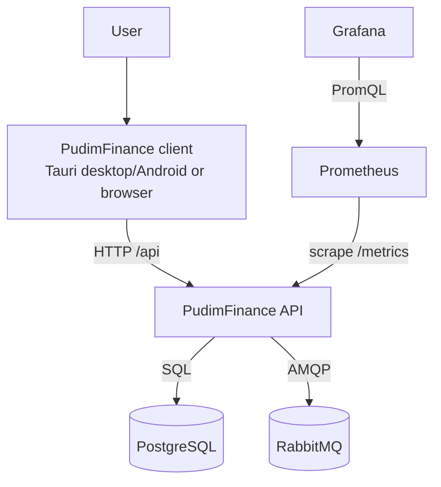
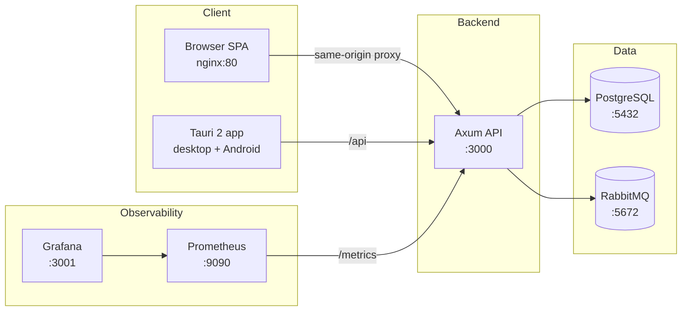
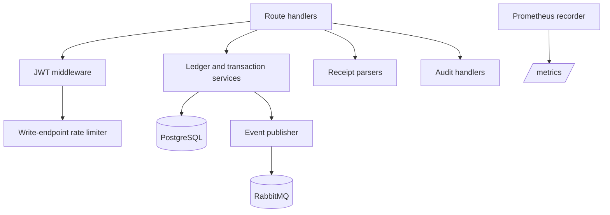

# Architecture

The diagrams describe the current Compose deployment and the runtime boundaries
between the client, API, data stores, and observability services.

## Context

## Containers

## Backend components

## Compose services

| Service | Image/source | Host port | Role |
|---|---|---:|---|
| `postgres` | `postgres:16-alpine` | 5432 | Primary data store |
| `rabbitmq` | `rabbitmq:3.13-management-alpine` | 5672, 15672 | Event broker and management UI |
| `backend` | `backend/Dockerfile` | 3000 | API, migrations, metrics |
| `web` | `desktop/Dockerfile.web` | 5173 | Browser SPA and same-origin proxy |
| `prometheus` | `prom/prometheus:v2.53.0` | 9090 | Metrics storage |
| `grafana` | `grafana/grafana:11.1.0` | 3001 | Provisioned dashboard |

The AWS Terraform directory is intentionally separate and currently provides
only a partial foundation. See [`../infra/README.md`](../infra/README.md).