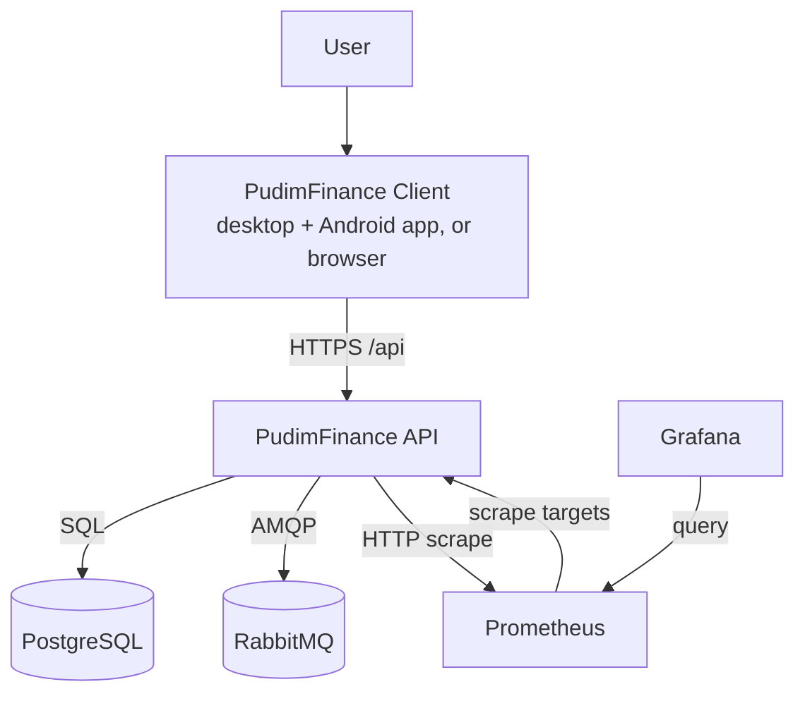
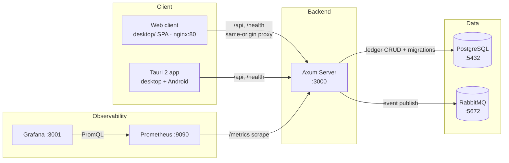
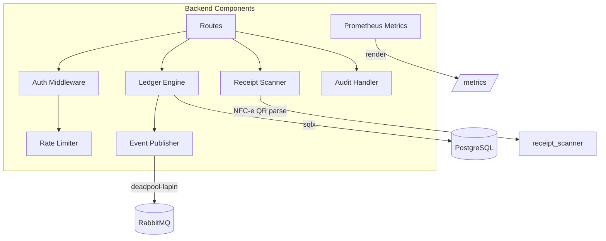

# Architecture — C4 Model

> C4 model diagrams for PudimFinance (Context, Container, Component).
> Layer 4 final documentation.

---

## Level 1 — Context

---

## Level 2 — Container

---

## Level 3 — Component (Backend)

---

## Deployment (Docker Compose Services)

| Service | Image | Port(s) | Purpose |
|---------|-------|---------|---------|
| `postgres` | postgres:16-alpine | 5432 | Primary data store |
| `rabbitmq` | rabbitmq:3.13-management | 5672, 15672 | Event broker |
| `backend` | local (rust) | 3000 | Axum API + metrics |
| `web` | local (nginx + `desktop/` build) | 5173→80 | Client SPA served to browsers; proxies `/api` + `/health` to the backend |
| `prometheus` | prom/prometheus:v2.53 | 9090 | Metrics collection |
| `grafana` | grafana/grafana:11.1 | 3001 | Dashboards |

---

## Key Dependencies

- **Axum** — HTTP framework
- **sqlx** — async PostgreSQL (runtime-tokio, tls-rustls)
- **lapin + deadpool-lapin** — AMQP client for event publishing
- **jsonwebtoken + argon2** — auth
- **metrics + metrics-exporter-prometheus** — observability
- **utoipa** — OpenAPI generation
- **recharts** — client charts
- **Tauri 2 + React/Vite/Tailwind** — desktop + Android client (the same frontend is also served as the browser client)
